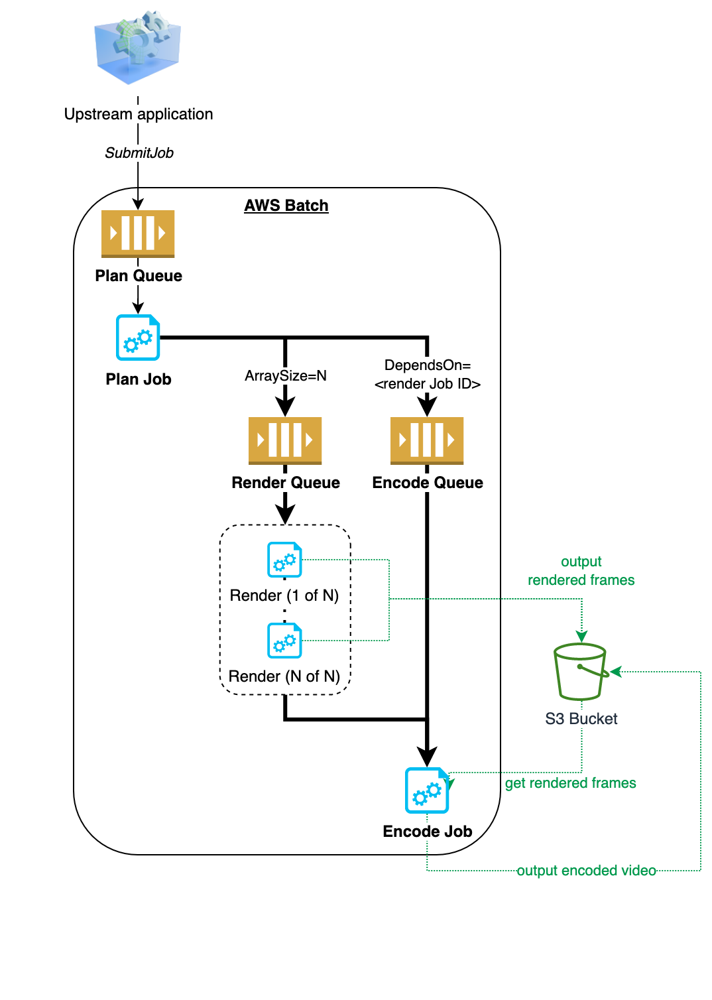

# Parralelization and Job Dependencies with AWS Batch

This project uses the AWS CDK to synthesize and deploy a CloudFormation stack that provides a mockup of using AWS Batch to run a workflow to render mini-batches of image frames and, when all rendering is complete, run an encoding job to assemble a video. 

The architecture includes: 



1. An AWS Batch job definition and job queue for each of three steps in the workflow: 

    1. **Plan** - determines how many frames to render, how many parallel rendering jobs are needed, and submit the rendering jobs to AWS batch; also submits a single encoding job that has a dependency on all rendering jobs completing for a given workflow. 

    2. **Render** - renders a portion of the total needed frames; jobs created and run in parallel and rendering a portion of the required total frames. 

    3. **Encode** - a single encoding job that assembles the results of rendering once all upstream rendering jobs are complete. 

2. A single ECR container image built from a local Dockerfile in this project and used by all three job definitions above. (single container was for demo convenience, separate containers recommended)

3. A single EC2 shared compute environment used by all three job queues running in a newly-created VPC. 

4. Containers configured to ship stdout and stderr logs to Amazon CloudWatch Logs. 

5. An S3 Bucket that may be used by jobs to read inputs (e.g. creative code) or write output files (e.g. rendered frames or videos). _Demo does not actually read or create objects in bucket_

6. A DynamoDB table that may be used by jobs to log data, share job outputs with downstream jobs or applications, or read inputs from upstream applications. _Light example of simple job logging included_.

7. Partial implementation of AWS X-Ray within container code to provide distributed tracing of workflows.

Refer to the CloudFormation stack created by CDK for a full inventory of other supporting resources, such as IAM roles. 

## Prerequisites

1. AWS CLI configured to use a dev or test account in AWS
2. Recent version of Node (e.g. 18+)
3. AWS CDK (`npm install -g aws-cdk`)
4. jq (`brew install jq`)
5. Docker

## Quick Start

1. Navigate to project root and install dependencies: `npm install`

2. Deploy project as a CloudFormation stack using AWS CDK CLI: `cdk deploy`

3. Submit the "plan" job definition to its respective queue:

```sh
STACK_NAME=AwsBatchDemoStack
outputs=$(aws cloudformation describe-stacks --stack-name $STACK_NAME --query 'Stacks[].Outputs[]' --output json)
job_queue=$(echo $outputs | jq -r '.[] | select(.OutputKey == "CfnOutputPlanJobQueue") | .OutputValue')
job_definition=$(echo $outputs | jq -r '.[] | select(.OutputKey == "CfnOutputPlanJobDefinition") | .OutputValue')

aws batch submit-job \
    --job-name manualSubmit-plan \
    --job-queue "$job_queue" \
    --job-definition "$job_definition" \
    --container-overrides \
        environment="[{name=TOTAL_FRAMES,value=120},{name=FRAMES_PER_RENDER_JOB,value=30}]"
```
